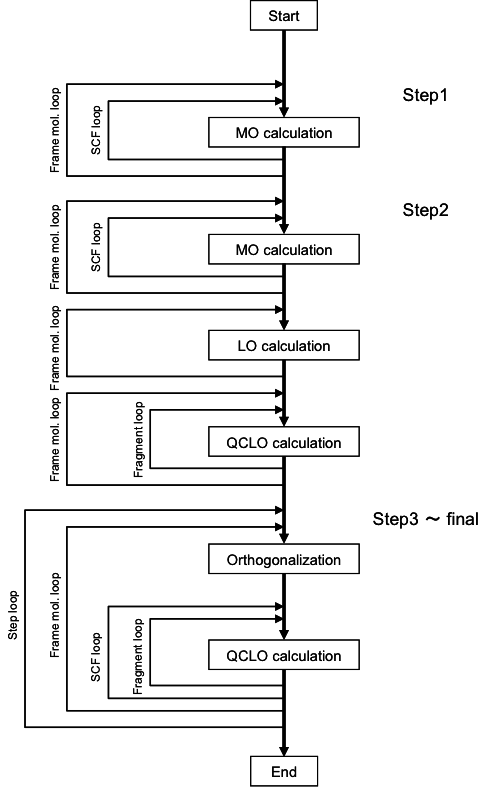

.. -*- coding: utf-8; -*-

*************************************
Automated calculation program QCLObot
*************************************

Introduction
============

The canonical electronic state calculations of proteins is performed by using the ProteinDF program, 
a program based on the density-functional molecular orbital method, 
and the QCLObot program, an automated calculation method program. 
The QCLObot creates the initial values for the execution of ProteinDF.
Upon execution of the QCLObot program, the ProteinDF program is obtained the initial guess 
and the all-electron canonical calculation by the ProteinDF program is performed, according to the calculation playbook.

半自動計算法プログラム QCLObot
---------------------------

タンパク質全電子自動計算法プログラムは、
QCLO法またはRMO法を用いた収束過程支援のプログラムです。
アミノ酸残基などの単位で局在化していますが、
その中ではアミノ酸残基単体の軌道であるカノニカル軌道に近いQCLOやRMOを切り貼りすると、
ペプチド鎖の分子軌道計算のよい初期値になります。
ペプチド鎖の分子軌道計算結果から再度QCLOやRMOを求め、
さらに大きなペプチド鎖の計算の初期値とし、
これらのペプチド延長過程を繰り返して全電子計算を行う手法をタンパク質の全電子自動計算収束過程法と呼びます。
これにより容易に機能性に富んだタンパク質の精密な量子化学計算を実行できるようになります。

タンパク質全電子計算の収束過程
------------------------------

一般に、タンパク質やペプチド鎖のような大きな分子の電子状態は、
はじめから一点計算を行うことが困難です。
タンパク質をアミノ酸残基のような小さな分子片に分割して、
それらの計算で求められた解を基に徐々に大きなペプチド鎖を計算していくといった手法を用います。
本手法の概要を :num:`Fig. #qclosteps` に示します。

.. _qclosteps:

.. figure:: figure/QCLO_steps.png
   :alt: QCLO_steps.png
   :align: center
   :width: 8cm

   タンパク質全電子計算収束過程の概要

ステップ1 ではタンパク質やペプチド鎖をアミノ酸残基1 残基ずつに分割し、これらの計算を行います。
ステップ2 ではステップ1 で計算された1 残基の結果をもとに、3 残基ずつの計算を実行します。
このようにステップ2 以降では重なりを持って切り出します。
同様にステップ3 ではステップ2 の3 残基の結果をもとに数残基のペプチド鎖の計算を実行します。
このとき、ペプチド鎖の両端は対応する2 残基、間は真ん中の1 残基の結果をつなげて、初期値を作成します。
このような操作を繰り返すことにより、次第にペプチド鎖の長さを延長して、
最終的に全タンパク質の計算を実行します。
この収束過程で作成される分子をフレーム分子とよびます。
なお、ステップ1ではHarrisの初期値、ステップ2ではステップ1で計算された電子密度を合成して初期値を作ります。
しかし、つなげる分子の数が多いほど誤差が蓄積しますし、
重なりを持たせているとはいえ、結合部分では比較的大きな誤差が生じます。
このような誤差は大きな分子の分子軌道計算には致命的な欠陥を生じることがあります。
そこで、ステップ3 以降では、新しい局在化軌道をベースにした初期値合成方法を使用します。

Canonical and Localized orbitals
--------------------------------

The representation of molecular orbitals has many degrees of freedom and 
can be transformed into many things by unitary transformation. 
Two representations of molecular orbitals are often used to exploit this property: 
canonical orbitals, which are canonical orthogonal systems, 
and localized orbitals, which are localized orbitals. 
One is the canonical orbital, which is a canonical orthogonal system, and the other is the localized orbital. 
Localized Orbitals are determined to be maximally localized in the narrowest space. 
Localized orbitals are determined by the formulae of the localized orbitals proposed by Edmiston-Rüdenberg and Foster-Boys, 
but there are also methods such as Pipek-Mezey's Population method and Gu's RMO method. 
Both of these methods are formulated in such a way that the indices become larger as the orbits are localized in a particular space. 
In particular, the orbitals localized by the Edmiston-Rüdenberg, Population, and RMO methods are generally localized around the nucleus, 
the valence electrons involved in the bond are localized around the bond, 
and the valence electrons not involved in the bond are localized in the form of so-called isolated electron pair orbitals.
This is why it is well known for its ability to match the chemist's intuition.

本システムでは、Edmiston-Rüdenberg法よりも高速な、Population 法とRMO法を採用しました。
ペプチド鎖の良い初期値を合成するために、ステップ3 以降では局在化軌道を用います。
分子軌道を局在した形で表現すれば、分子軌道を化学的によい近似で個別に取り扱うことができます。
つまり煩雑な手続きが必要ですが、局在化軌道が作られれば安全かつ自由に分子軌道を分離結合することが可能になります。
これにより精度の良い初期値を作成することができます。
この切り貼りに便利な軌道をその性質から、先に擬カノニカル局在化軌道(QCLO)と名付けました。
RMO法はまったく異なる計算方法ですが、特定の領域に局在化させた軌道を作成する方法で、基本的に取り扱い方は変わりません。
一般に、分子サイズが大きくなるほど、RMO法の方が高速に計算できます。
これらを用いて初期値を作成する方法は :num:`Fig. #qclofragment` に示すように、
ペプチド鎖をアミノ酸残基の側鎖やアミノ酸をつなぐペプチド結合などの部分（これらをフラグメントと呼ぶ）に分割し、
フラグメントのみに広がり、かつフラグメントのカノニカル分子軌道に似た軌道を求め、
これらを組み合わせてペプチド鎖全体の分子軌道計算の初期値とする方法です。
局在化軌道を求めるには、計算目的となる分子の周辺の影響を取り込むため、
またペプチド結合の部分を厳密に表現するために3 残基以上のフレーム分子から出発します。
このフレーム分子においてペプチド鎖の場合のフラグメントは主鎖と側鎖の2 パターンに分類します。
こう分類することで本システムでは自動的にフラグメントに分けることができます。

.. _qclofragment:

.. figure:: figure/QCLO_fragment.png
   :alt: QCLO_fragment.png
   :align: center
   :width: 8cm

   フレーム分子THR-VAL-GLUとフラグメント

QCLOおよびRMO作成の手順は以下の通りです。

* 手順1 : フレーム分子毎の分子軌道計算

フレーム分子の分子軌道計算を実行します。
フレーム分子の構造はペプチド鎖の相当部分と同じものを用い、
切断されたＮ末、C 末にそれぞれH、OH を付加します。ここで得られる軌道はフレーム分子全体に広がったカノニカル軌道です。

* 手順2 : フレーム分子毎の局在化軌道計算

手順1 で得られた分子軌道を個々の化学結合や孤立電子対に局在する分子軌道に変換します。QCLOとRMOではこの計算方法が異なります。

* 手順3 : フラグメント毎の擬カノニカル局在化軌道計算

手順2 で得られた軌道の中から各フラグメントに属す局在化軌道を選び出し、
それらの係数行列を使用してフレーム分子のKohn-Sham 行列（ab initio HF 法ならばFock行列）を
原子軌道ベースから局在化軌道ベースに変換します。
そうして作られたフラグメントのKohn-Sham 行列の固有値方程式を解くことで
フラグメントに局在しつつ、フラグメント全体に広がった軌道が求められます。
以上の手順1～3 でQCLOまたはRMOが得られます。
手順1～3 をすべてのフレーム分子とそのフラグメントで実行し、初期値は手順4 で作成します。

* 手順4 :局在化軌道の結合

手順3 で計算されたQCLOやRMOはフレーム分子毎に計算されています。
まず、手順1 で付加した原子H、OH の軌道成分は本来のペプチド鎖には存在しないため、取り除きます。
すべてのフラグメントのQCLOまたはRMOを組み合わせてペプチド鎖全体の軌道セットを作成します。
この軌道セットは規格直交化されていないため、ここでLöwdinの直交化を実行します。
Löwdin の直交化はもとの軌道をなるべく変えないように規格直交化を達成しますので、
得られた軌道は手順3 の軌道とほとんど変わりません。これによりペプチド鎖全体で規格直交したLCAO 行列が得られます。

手順1～4 の手順を組み合わせた方法を、タンパク質全電子計算の収束過程と呼びます。

automatic calculation program based on the QCLO method
^^^^^^^^^^^^^^^^^^^^^^^^^^^^^^^^^^^^^^^^^^^^^^^^^^^^^^

This is an automatic calculation function based on the QCLO method.
Using the fragment-by-fragment QCLO calculation results of the ProteinDF program,
It has the ability to generate initial guess (LCAO) for the ProteinDF program.

In the ProteinDF program, the Roothaan equation :math:`FC=SC\epsilon` is solved 
by using the converting matrix :math:`X=U \cross s^{-1/2}`.

1. Convert the Khon-Sham matrix based on Atomic orbital (AO) basis to an orthogonalized basis

.. math::
   
   F'=X^{t}FXC

2. KS 行列に対するレベルシフト  

.. math::
   
   F'=F'+C'(C'*\beta)^{\dagger}

3. KS 行列の対角化し、直交化基底での係数行列を得る

.. math::
   
   F'C'=C'\epsilon'

4. 係数行列を AO 基底に変換

.. math::
   
   C=XC'

QCLO 法の計算方法の概要を以下に示します。

* 第1ステップ：

普通の SCF MO 計算を全アミノ酸に対して行います。初期電子密度は、原子の電子密度から作成します。

* 第2ステップ：

初期電子密度は、第１ステップで得られたモノマーの電子密度を切り貼りする。
局在化軌道（LO）をフラグメントに振り分けた後、フラグメントの QCLO は、次の式によって求められます。
この固有方程式の解が QCLO です。

.. math::
   
   F'=C_{LO}^{t}FC_{LO}
   
   F'C'=C'\epsilon'

| :math:`F` フレーム分子の Fock or Kohn-Sham 行列
| :math:`C_LO` フラグメントに割り振られた LO の係数行列
| :math:`F'` フラグメントの Fock or Kohn-Sham 行列（LO 基底）

* 第3ステップ以降：

第2ステップの QCLO を集めて初期値を作成する。
集められた QCLO は Löwdin変換によって直交化しなければなりませんが、
変換しても元の QCLO からはほとんど変化しません。
直交化された QCLO から、フラグメントに対する初期値が作成される。
フラグメントに対する Fock もしくは Kohn-Sham 行列は、以下の式で求められます。

.. math::
   
   F'=C_{QCLO}^{t}FC_{QCLO}

| :math:`C_{QCLO}` QCLO の係数行列（原子軌道基底）

この解は、前のステップの QCLO で張られた空間における、第3ステップの QCLO です。
QCLO 法の処理フローを :num:`Fig. #qcloflow`  に示します。

.. _qcloflow:

   QCLO法の処理フロー
