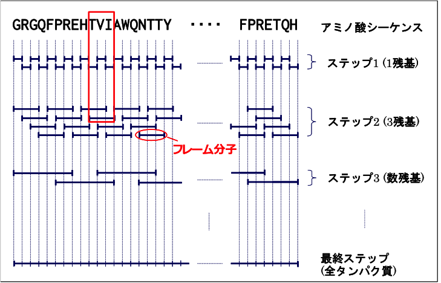
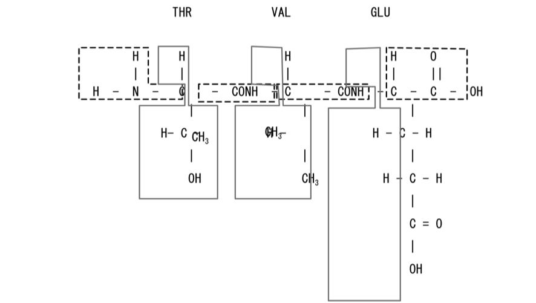
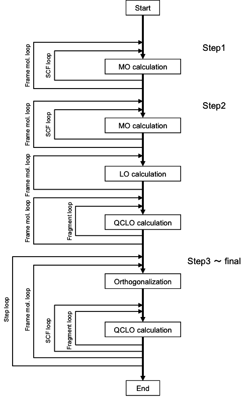

.. -*- coding: utf-8; -*-

*************************************
Automated calculation program QCLObot
*************************************

Introduction
============

The canonical electronic state calculations of proteins is performed by using the ProteinDF program, 
a program based on the density-functional molecular orbital method, 
and the QCLObot program, an automated calculation method program. 
The QCLObot creates the initial values for the execution of ProteinDF.
Upon execution of the QCLObot program, the ProteinDF program is obtained the initial guess 
and the all-electron canonical calculation by the ProteinDF program is performed, according to the calculation playbook.

automatic computation program based on the QCLO method QCLObot
--------------------------------------------------------------

QCLObot is an automated calculation program to assist in the calculation of giant system canonical molecular orbitals; 
QCLOs are localized orbitals that are localized in one region but are close to canonical molecular orbitals in that region. 
By cutting and pasting subunit QCLOs, 
we can obtain good initial values for molecular orbital calculations in larger regions. 
The QCLO method is a method to calculate canonical molecular orbitals of large systems by repeating the process of expanding the computational domain by obtaining the QCLO again. 
This method enables us to perform precise quantum chemical calculations of functionally rich proteins in an easy and safe manner.

Convergence process of the protein all-electron calculation
-------------------------------------------------------------

In general, it is difficult to perform a single-point calculation from the
outset on the electronic states of large molecules such as proteins or
peptide chains. Instead, we use a method in which the protein is divided
into small molecular fragments, such as amino acid residues, and the
peptide chain is gradually built up to its full size based on the
solutions obtained from the calculations of these fragments. An overview
of this method is shown in :num:`Fig. #qclosteps`.

.. _qclosteps:

   Overview of the convergence process of the protein all-electron calculation

In Step 1, the protein or peptide chain is divided into single amino acid
residues, and a calculation is performed for each residue. In Step 2,
based on the single-residue results obtained in Step 1, calculations are
performed for windows of three residues. From Step 2 onward, the windows
are cut out with overlap in this way. Similarly, in Step 3, calculations
are performed for a peptide chain of several residues based on the
three-residue results of Step 2. Here, the initial guess is constructed
by joining the results of the two corresponding residues at each end of
the peptide chain with the result of the single residue in between. By
repeating this operation, the peptide chain is gradually extended in
length until, finally, the calculation of the entire protein is
performed. The molecules created during this convergence process are
called frame molecules. Note that in Step 1 the Harris guess is used as
the initial guess, while in Step 2 the initial guess is constructed by
combining the electron densities calculated in Step 1. However, the more
molecules that are joined together, the more the error accumulates, and
even though overlap is used, a relatively large error occurs at the
junctions. Such errors can be fatal to molecular orbital calculations of
large molecules. For this reason, from Step 3 onward, an initial-guess
construction method based on a new set of localized orbitals is used.

Canonical and Localized orbitals
--------------------------------

The representation of molecular orbitals has many degrees of freedom and 
can be transformed into many things by unitary transformation. 
Two representations of molecular orbitals are often used to exploit this property: 
canonical orbitals, which are canonical orthogonal systems, 
and localized orbitals, which are localized orbitals. 
One is the canonical orbital, which is a canonical orthogonal system, and the other is the localized orbital. 
Localized Orbitals are determined to be maximally localized in the narrowest space. 
Localized orbitals are determined by the formulae of the localized orbitals proposed by Edmiston-Rüdenberg and Foster-Boys, 
but there are also methods such as Pipek-Mezey's Population method and Gu's RMO method. 
Both of these methods are formulated in such a way that the indices become larger as the orbits are localized in a particular space. 
In particular, the orbitals localized by the Edmiston-Rüdenberg, Population, and RMO methods are generally localized around the nucleus, 
the valence electrons involved in the bond are localized around the bond, 
and the valence electrons not involved in the bond are localized in the form of so-called isolated electron pair orbitals.
This is why it is well known for its ability to match the chemist's intuition.

In this system, we adopted the Population method and the RMO method,
both of which are faster than the Edmiston-Rüdenberg method. To
construct a good initial guess for the peptide chain, localized orbitals
are used from Step 3 onward. By representing molecular orbitals in a
localized form, the molecular orbitals can be treated individually with
good chemical approximation. In other words, although a somewhat
elaborate procedure is required, once the localized orbitals have been
constructed it becomes possible to safely and freely separate and
combine molecular orbitals. This makes it possible to construct an
accurate initial guess. Because of their usefulness for this kind of
cut-and-paste construction, we named these orbitals quasi-canonical
localized orbitals (QCLO). The RMO method is a completely different
calculation method, but it likewise produces orbitals localized in a
specific region, and the way it is handled is essentially the same. In
general, the larger the molecule, the faster the RMO method can be
computed. As shown in :num:`Fig. #qclofragment`, the method for
constructing the initial guess using these orbitals divides the peptide
chain into parts such as the side chains of amino acid residues and the
peptide bonds connecting amino acids (these parts are called fragments),
obtains orbitals that are spread only over each fragment and resemble
the canonical molecular orbitals of that fragment, and then combines
these to form the initial guess for the molecular orbital calculation of
the entire peptide chain. To obtain the localized orbitals, the
calculation starts from a frame molecule of three or more residues, in
order to incorporate the influence of the surroundings of the molecule
of interest and to accurately represent the peptide bond regions. In
this frame molecule, the fragments of the peptide chain are classified
into two patterns: the main chain and the side chains. This
classification allows the system to automatically divide the molecule
into fragments.

.. _qclofragment:

   Frame molecule THR-VAL-GLU and its fragments

The procedure for constructing QCLO and RMO is as follows.

* Step 1: Molecular orbital calculation for each frame molecule

A molecular orbital calculation is performed for the frame molecule. The
structure of the frame molecule is taken to be identical to the
corresponding part of the peptide chain, with H and OH added to the
cleaved N-terminus and C-terminus, respectively. The orbitals obtained
here are canonical orbitals spread over the entire frame molecule.

* Step 2: Localized orbital calculation for each frame molecule

The molecular orbitals obtained in Step 1 are converted into molecular
orbitals localized on individual chemical bonds and lone electron pairs.
This conversion is computed differently for QCLO and for RMO.

* Step 3: Quasi-canonical localized orbital calculation for each fragment

The localized orbitals belonging to each fragment are selected from
among the orbitals obtained in Step 2, and their coefficient matrices
are used to transform the Kohn-Sham matrix of the frame molecule (or the
Fock matrix, in the case of the ab initio HF method) from the
atomic-orbital basis to the localized-orbital basis. By solving the
eigenvalue equation of the Kohn-Sham matrix of the fragment constructed
in this way, orbitals are obtained that are localized on the fragment
while being spread over the fragment as a whole. QCLO or RMO is obtained
through Steps 1 to 3 above. Steps 1 to 3 are carried out for every frame
molecule and its fragments, and the initial guess is then constructed in
Step 4.

* Step 4: Combination of the localized orbitals

The QCLO or RMO computed in Step 3 is calculated separately for each
frame molecule. First, the orbital components of the H and OH atoms
added in Step 1 are removed, since they do not exist in the original
peptide chain. The QCLO or RMO of all fragments are then combined to
construct the orbital set for the entire peptide chain. Because this
orbital set is not orthonormalized, Löwdin orthogonalization is
performed at this point. Since Löwdin orthogonalization achieves
orthonormalization while changing the original orbitals as little as
possible, the resulting orbitals are almost identical to the orbitals
from Step 3. This yields an orthonormalized LCAO matrix for the entire
peptide chain.

The method combining Steps 1 through 4 is called the convergence process
of the protein all-electron calculation.

automatic calculation program based on the QCLO method
^^^^^^^^^^^^^^^^^^^^^^^^^^^^^^^^^^^^^^^^^^^^^^^^^^^^^^

This is an automatic calculation function based on the QCLO method.
Using the fragment-by-fragment QCLO calculation results of the ProteinDF program,
It has the ability to generate initial guess (LCAO) for the ProteinDF program.

In the ProteinDF program, the Roothaan equation :math:`FC=SC\epsilon` is solved 
by using the converting matrix :math:`X=U s^{-1/2}`.

1. Convert the Khon-Sham matrix based on Atomic orbital (AO) basis to an orthogonalized basis

.. math::
   
   F'=X^{t}FXC

2. Apply a level shift to the KS matrix

.. math::

   F'=F'+C'(C'*\beta)^{\dagger}

3. Diagonalize the KS matrix to obtain the coefficient matrix in the orthogonalized basis

.. math::

   F'C'=C'\epsilon'

4. Transform the coefficient matrix to the AO basis

.. math::
   
   C=XC'

An overview of the QCLO method calculation procedure is given below.

* Step 1:

A conventional SCF MO calculation is performed for all amino acids. The
initial electron density is constructed from the atomic electron
densities.

* Step 2:

The initial electron density is constructed by cutting and pasting the
monomer electron densities obtained in Step 1. After the localized
orbitals (LO) are assigned to the fragments, the QCLO of each fragment
is obtained from the following equation. The solution of this
eigenvalue equation is the QCLO.

.. math::

   F'=C_{LO}^{t}FC_{LO}

   F'C'=C'\epsilon'

| :math:`F` Fock or Kohn-Sham matrix of the frame molecule
| :math:`C_LO` coefficient matrix of the LO assigned to the fragment
| :math:`F'` Fock or Kohn-Sham matrix of the fragment (in the LO basis)

* Step 3 and beyond:

The initial guess is constructed by collecting the QCLO from Step 2. The
collected QCLO must be orthogonalized by the Löwdin transformation, but
this transformation changes the original QCLO very little. From the
orthogonalized QCLO, the initial guess for each fragment is constructed.
The Fock or Kohn-Sham matrix for the fragment is obtained by the
following equation.

.. math::

   F'=C_{QCLO}^{t}FC_{QCLO}

| :math:`C_{QCLO}` coefficient matrix of the QCLO (in the atomic-orbital basis)

This solution is the QCLO of Step 3 within the space spanned by the QCLO
of the previous step. The processing flow of the QCLO method is shown in
:num:`Fig. #qcloflow`.

.. _qcloflow:

   Processing flow of the QCLO method
